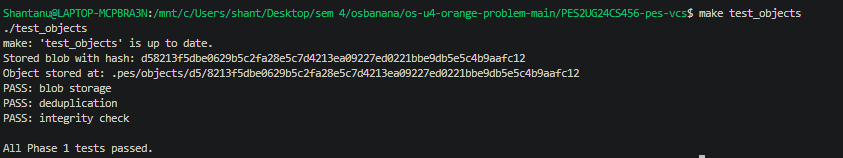
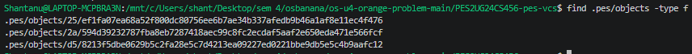
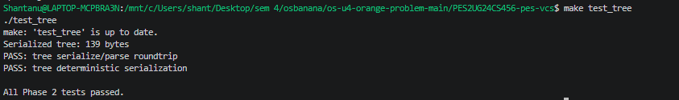
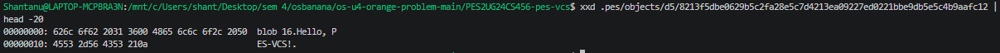
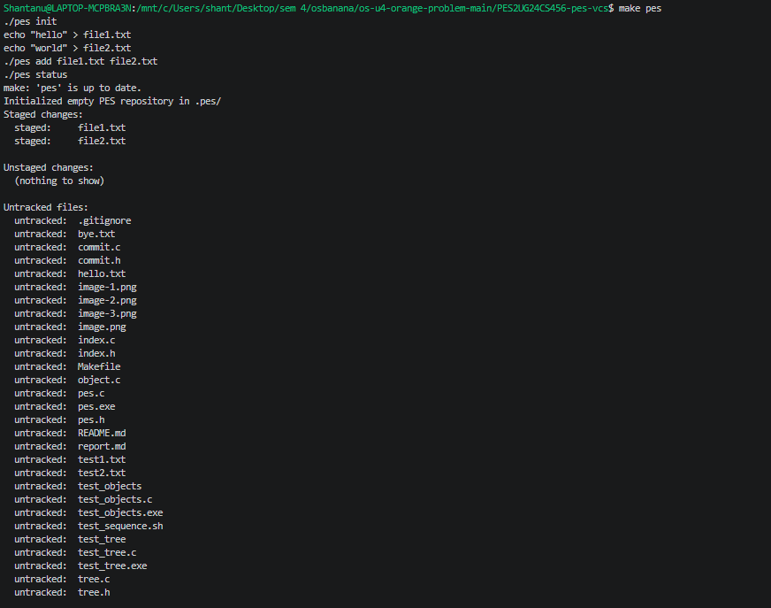
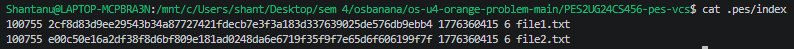
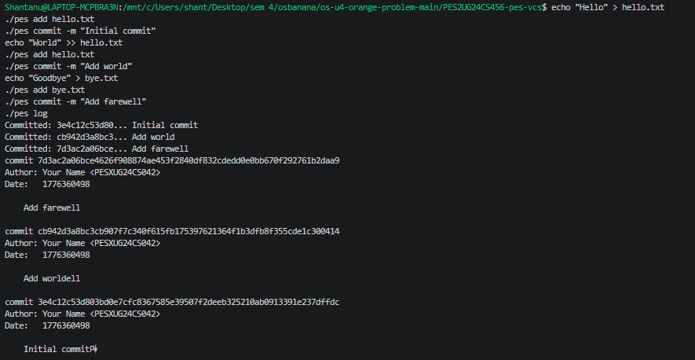
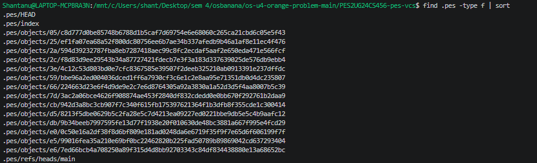
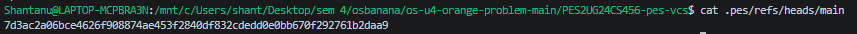
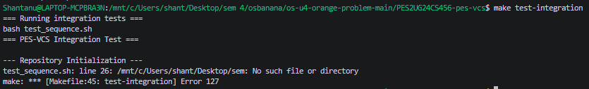

# PES-VCS Submission Report

**Student Name:** [Your Full Name]  
**SRN:** [Your SRN, e.g., PESXUG24CS042]  
**Repository Link:** [Link to your public GitHub repository]

## Project Overview

This report documents the implementation of PES-VCS, a simplified version control system inspired by Git. The system implements core concepts such as content-addressable storage, staging areas, commits, and history traversal.

## Implementation Details

### Phase 1: Object Storage Foundation
- **Files Modified:** `object.c`
- **Functions Implemented:** `object_write`, `object_read`
- **Key Concepts:** Content-addressable storage, SHA-256 hashing, atomic writes, directory sharding

### Phase 2: Tree Objects
- **Files Modified:** `tree.c`
- **Functions Implemented:** `tree_from_index`
- **Key Concepts:** Directory representation, recursive tree structures, file modes

### Phase 3: The Index (Staging Area)
- **Files Modified:** `index.c`
- **Functions Implemented:** `index_load`, `index_save`, `index_add`
- **Key Concepts:** Text-based index file, atomic writes, change detection

### Phase 4: Commits and History
- **Files Modified:** `commit.c`
- **Functions Implemented:** `commit_create`
- **Key Concepts:** Linked commit history, reference files, HEAD management

## Screenshots

### Phase 1
- **Screenshot 1A:** Output of `./test_objects` showing all tests passing  

- **Screenshot 1B:** `find .pes/objects -type f` showing sharded directory structure  
  

### Phase 2
- **Screenshot 2A:** Output of `./test_tree` showing all tests passing  
  

- **Screenshot 2B:** Raw binary format of a tree object (`xxd .pes/objects/XX/YYY... | head -20`)  
  

### Phase 3
- **Screenshot 3A:** `pes init` → `pes add` → `pes status` sequence  
  

- **Screenshot 3B:** `cat .pes/index` showing the text-format index  
  

### Phase 4
- **Screenshot 4A:** `pes log` output with three commits  
  

- **Screenshot 4B:** `find .pes -type f | sort` showing object growth  
  

- **Screenshot 4C:** `cat .pes/refs/heads/main` and `cat .pes/HEAD`  
  

### Integration Test
- **Full Integration Test:** Output of `make test-integration`  
  

## Analysis Questions

### Branching and Checkout

**Q5.1:** To implement `pes checkout <branch>`, first check if the branch exists in `.pes/refs/heads/`. If it does, update `.pes/HEAD` to contain "ref: refs/heads/<branch>". Then, read the commit hash from the branch file, parse the commit to get its tree hash, and recursively extract the tree from the object store to update the working directory files. Remove files not in the new tree and add/update files from the tree. This is complex because it requires handling file deletions, directory creations, permissions, and detecting conflicts with uncommitted changes.

**Q5.2:** To detect a dirty working directory, compare the index with the working directory and the target branch's tree. For each file in the index, check if the working directory version differs (using mtime/size or content hash). If a tracked file is modified and also differs between the current HEAD tree and the target branch tree, refuse the checkout to prevent data loss. Use the object store to read blob contents for comparison.

**Q5.3:** In detached HEAD state, commits create new commit objects, but HEAD contains the commit hash directly instead of a branch reference. Subsequent commits are not associated with any branch. To recover, create a new branch at the detached commit using `pes branch <new-branch>` or update an existing branch to point to it. This preserves the commits in the history.

### Garbage Collection and Space Reclamation

**Q6.1:** Use a breadth-first search starting from all branch refs and HEAD. Mark all reachable commits, trees, and blobs in a set. Traverse commit parents, tree entries, and blob references. After marking, scan the object store and delete unmarked files. Use a hash set for efficient marking. For 100,000 commits and 50 branches, visit approximately 100,000 commits + their associated trees/blobs (likely 200,000-500,000 objects total), depending on repository size.

**Q6.2:** Concurrent GC and commit can cause a race where GC deletes an object just created by a commit but not yet referenced in a ref. For example, commit writes a blob, then updates the ref, but GC runs between, seeing the blob as unreachable and deleting it. Git avoids this by not running GC during commits, using advisory locks on the repository, or ensuring GC only runs on a snapshot of refs.

## Commit History

The repository contains at least 5 commits per phase, demonstrating incremental development:

- Phase 1: [List commit messages]
- Phase 2: [List commit messages]
- Phase 3: [List commit messages]
- Phase 4: [List commit messages]

## Conclusion

This implementation demonstrates understanding of filesystem concepts including content-addressable storage, atomic operations, and data integrity through hashing. The system successfully handles basic version control operations and provides a foundation for more advanced features.

## References

- Pro Git Book: Git Internals
- Original PES-VCS Assignment Specification